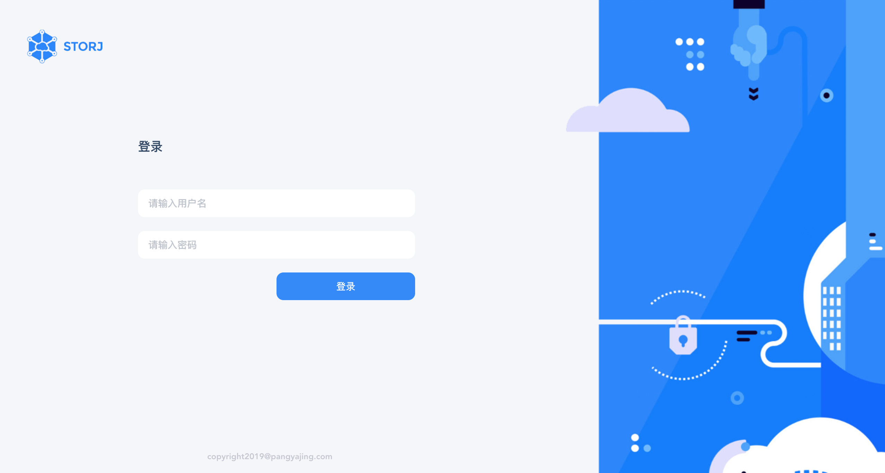
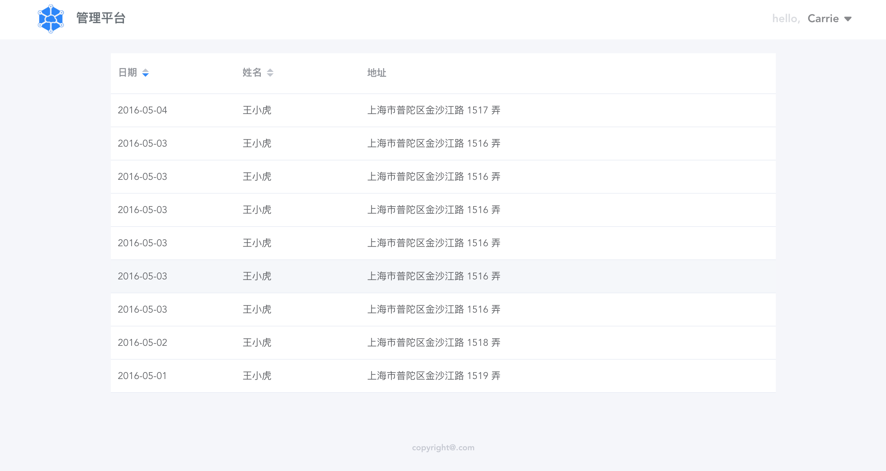

#   Vue-element-ts
## Login
[UI-source-behance](https://www.behance.net/gallery/80831863/Storj-Satellite-Account)



## Home
 

## Technology Stack 

- vue
- element
- ts
- axios
- sass
- prettier 


## Project setup
```
yarn install
```

### Compiles and hot-reloads for development
```
yarn serve
```

### Compiles and minifies for production
```
yarn build
```

### Lints and fixes files
```
yarn lint
```

